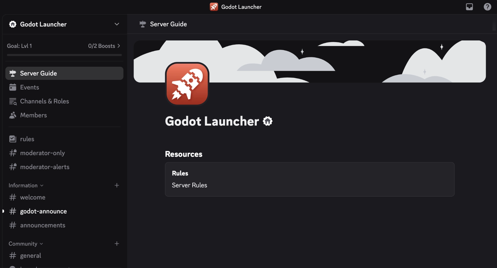

# Community

The Godot Launcher project is built by and for the community. Whether you're a new user, experienced developer, or contributor, you're welcome to join our **Discord server** and be part of the conversation.

---

## Join the Discord Server

Our official Discord is the best place to:

- Get help using the Godot Launcher
- Ask questions and report issues
- Share feedback and feature ideas
- Collaborate on documentation or code
- Chat with other users and contributors

👉 [Join the Discord](https://discord.gg/Ju9jkFJGvz)

:::info
The server is open to everyone. Whether you're just getting started or you want to contribute, you’re welcome!
:::

---

## Why Join?

Open source is powered by community. Your questions, suggestions, and contributions help shape the future of the Godot Launcher.

Being part of the Discord gives you:

- Direct access to the maintainer(s)
- Early discussion on new features and releases
- A way to contribute even without coding

---

## How to Help

Not sure how to get involved? Here are a few ways to contribute:

- Report bugs or missing docs
- Suggest improvements to the interface or workflow
- Help others in the Discord who are stuck
- Share your setup or tips with the community
- Write or review documentation
- Review translations or request new locales—drop feedback in the localisation channel or follow the [translation contribution guide](/contributing/translations)

No experience required—everyone can contribute.

---

## Stay Connected

We plan to grow this project together with the community.  
Join the conversation and help shape the future of Godot Launcher.

👉 [Join the Godot Launcher Discord](https://discord.gg/Ju9jkFJGvz)

---
