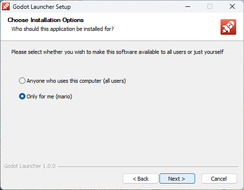

# Installation

The easiest and most reliable way to install the Godot Launcher is by visiting the official website [download page](https://godotlauncher.org/download). The launcher is cross-platform, works with Windows, macOS, and Linux systems.

## Download

[Download Godot Launcher](https://godotlauncher.org/download)

## Install

:::tip
On first launch, the launcher matches your operating system language automatically. You can change it anytime under **Settings → Appearance → Language**.
:::

### Windows

> **System Requirements:** Windows 10 or later (64-bit)

> **Filename:** `Godot_Launcher-x.y.z-win.exe`



On Windows, simply run the `.exe` installer after download, This it will automatically guide you through the installation process.

If you did not choose to run Godot Launcher at the end of the installation, you can run it directly from the Start Menu.

---

### macOS

**System Requirements:** macOS 10.15 Catalina or later

**Filename:** `Godot_Launcher-x.y.z-mac.universal.dmg`


For macOS Godot Launcher is distributed as a universal `.dmg`. Run the `.dmg` file and drag the `Godot Launcher` to the `Applications` folder when the dmg opens.

Once done, Godot Launcher can be opened from the Applications

---

### Linux (AppImage)

**System Requirements:** Modern 64-bit distribution (Ubuntu 20.04+, Fedora 36+, Arch-based, etc.)

:::info
AppImage builds include most dependencies — Make sure `FUSE` is available on your system.
:::

> Filename: `Godot_Launcher-x.y.z-linux.x86_64.AppImage`

For Linux, the Godot Launcher is distributed as an AppImage.
Make the `.AppImage` executable by using the GUI or by
running:

```bash
chmod +x Godot_Launcher-x.y.z-linux.x86_64.AppImage
```

Then, you can run it directly by double-clicking the file or executing:

```bash
./Godot_Launcher-x.y.z-linux.x86_64.AppImage
```
