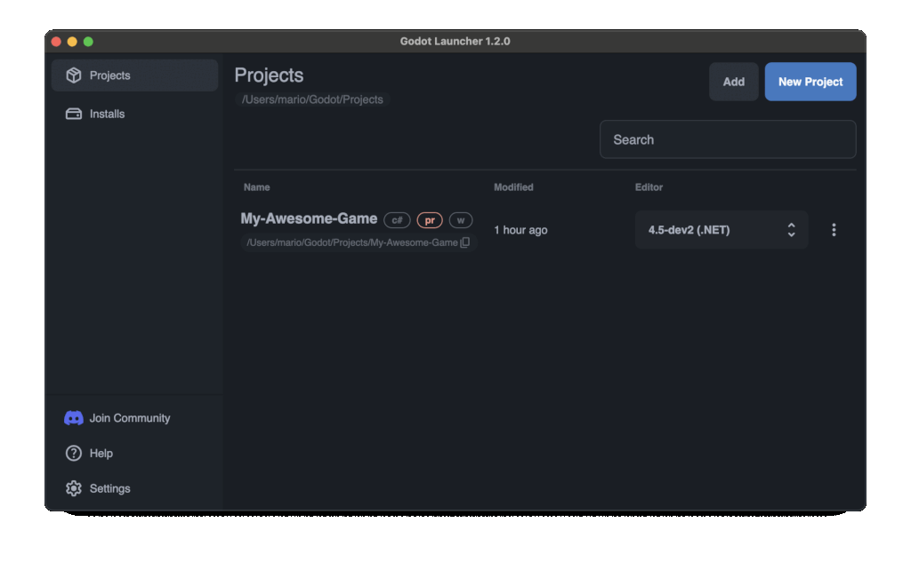

# Project Badges and Tooltips

**Introduced in Godot Launcher 1.2.0**

The Godot Launcher project list displays text-based badges next to each project entry. These badges communicate configuration details at a glance and assist in identifying projects that require special attention.

Each badge includes a tooltip that provides a short description when hovered.

## Badge Types

### `(c#)` – .NET Project Indicator

**Condition:** Displayed when the project is using the .NET (C#) variant of the Godot editor.

**Purpose:** Indicates that the project uses C# scripts and has a .NET Godot Editor version.

**Tooltip:** *This is a .NET project*

### `(pr)` – Pre-release Version Indicator

**Condition:** Displayed when the selected Godot version is labeled as a pre-release (e.g. alpha, beta, or release candidate).

**Purpose:** Helps identify projects running potentially unstable or experimental builds.

**Tooltip:** *Using a pre-release Godot Editor version*

### `(w)` – Windowed Launch Mode Indicator

**Condition:** Displayed when the "Open Windowed" setting is enabled for the project.

**Purpose:** Indicates that the Godot Editor will be launched with the `-w` flag, forcing windowed mode.

**Tooltip:** *This project is opened in windowed mode*

## Badge Placement

Badges appear in the following locations:

- In the **Project View** within the Godot Launcher main interface.
- Inline with each project entry.

Tooltips are accessible by hovering over the badge.

## Use Cases

Badges improve workflow clarity and reduce configuration guesswork. They are especially useful when:

- Managing mixed language environments (GDScript and C#)
- Working with experimental Godot versions

## Related Documentation

- [Launch Godot Project in Windowed Mode](../launch-godot-project-in-windowed-mode/)
- [Managing Godot Editor Versions](../manage-godot-versions)
- [Download Godot Launcher](https://godotlauncher.org/download/)

---

Badges are a lightweight but effective tool to communicate project-specific configurations directly from the project list.
